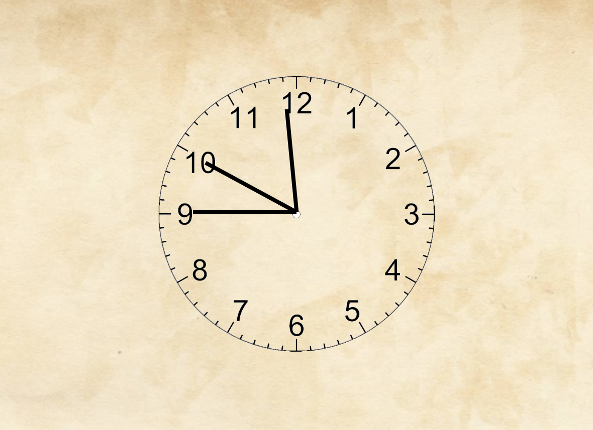

# JS-Clock
It's a CSS Clock which takes in the current time using JavaScript and updates the clock hands based on the current hour, minute and second.

<!-- [Do Visit](https://js-ghadyal.netlify.app/). -->

<a href="https://js-ghadyal.netlify.app/" target="_blank">Do Visit</a>

